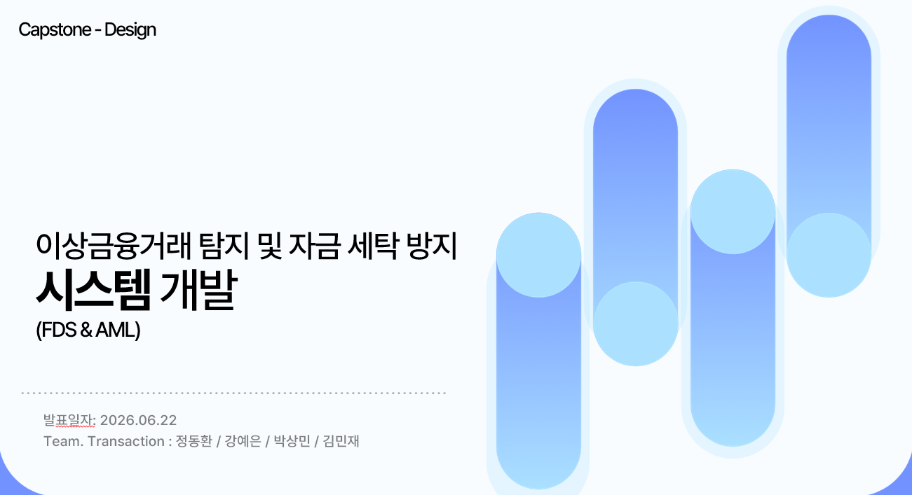
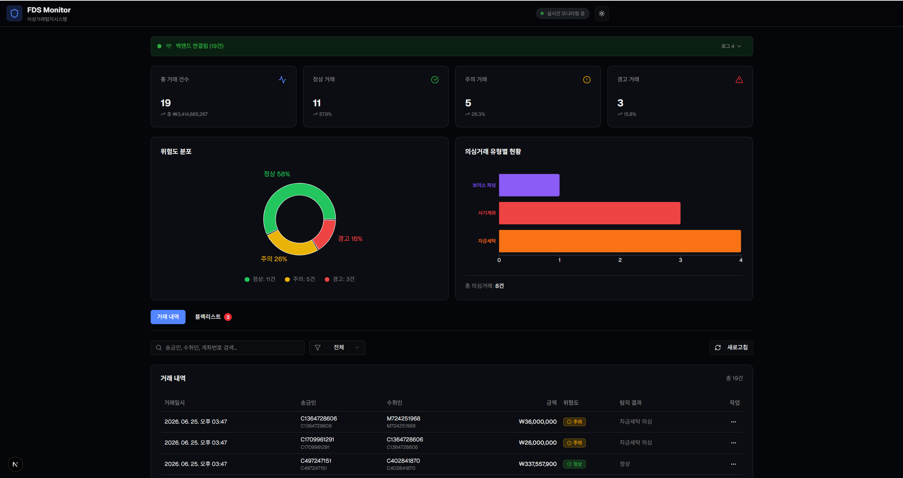
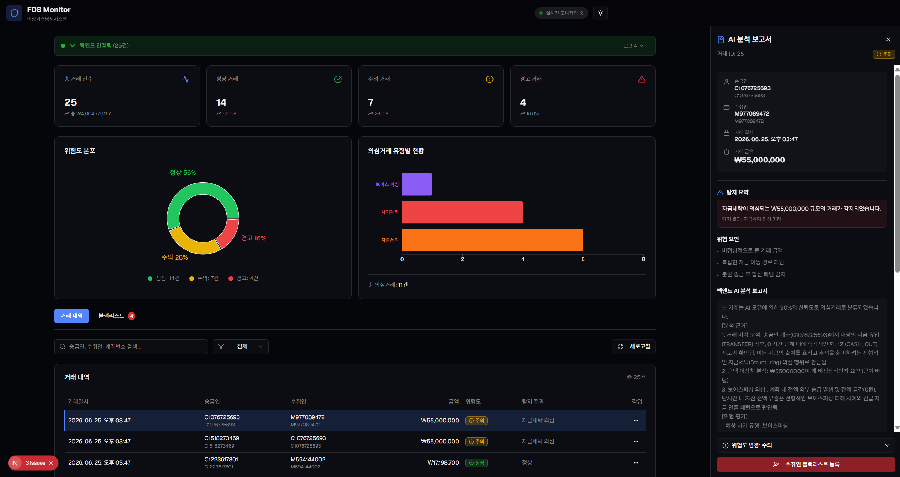
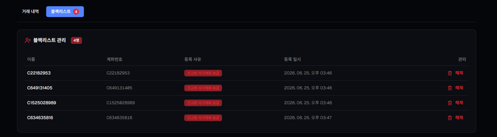
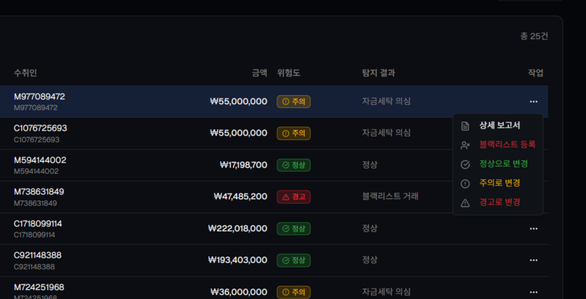

# 이상금융거래(FDS)탐지 및 자금세탁(AML) 방지 시스템 개발



### 팀원 소개

|       Front-end      |       Back-end        |       Infra      |       AI      |                          
| :--------------------------: |  :-----------------------------------: | :------------------------------------:| :------------------------------------:|
|  |  |  |    |
|[정동환](https://github.com/donghwanJ)|[강예은](https://github.com/yeeunnnnn)|[박상민](https://github.com/qkrtkdals962)|[김민재](https://github.com/WSIDFY)|

---
### 프로젝트 개요
- 머신러닝&AI&GCP(Google Cloude Platform)를 활용한 교내 캡스톤 디자인 프로젝트입니다.
- 현재 대부분의 금융거래가 전자금융거래 기반으로 운용되고 있으며, 이상거래를 실시간으로 탐지하여 고객의 자산을 효율적으로 보호할 수 있는 서비스의 필요성을 느끼게 되어 해당 주제를 기획하였습니다.

---
### 프로젝트 목표
- 상금융거래의 실시간 식별을 통한 금융범죄 대응 차세대 관제 서비스의 구현을 궁극적인 목표로 설정하였습니다.
- 자금 흐름을 실시간 모니터링하는 규제 기술을 경험하고 금융 솔루션을 개발해 봄으로써, 웹 개발 및 금융 보안 역량을 한 단계 더 성장시키는 것을 목표로 합니다.

---
### 주요 라이브러리 및 툴
<details>
<summary><b>Front-End</b></summary>

- Type Script
- React
- Next.js

</details>
<details>
<summary><b>Back-End</b></summary>

- GCP(Google Cloude Platform): 클라우드 컴퓨팅 서비스 플랫폼
- PostMan
- Ubuntu
- Spring Boot
- FastAPI
- MySQL(8.0): DataBase 
- PaySim(Kaggle): Dataset

</details>
<details>
<summary><b>AI & Machine learning</b></summary>

- Qwen(plus.ver): 알리바바 클라우드에서 제공하는 메인 스트림 LLM 모델
- xgboost: Decision Tree 기반 알고리즘을 바탕으로 한 오픈소스 머신러닝 모델
- pandas/numpy: PaySim 데이터셋 핸들링
- shap: 의심거래에 대한 근거 추출 (Qwen 리포트 생성용)
- fastapi/uvicorn: 실시간 탐지 API 서버 구축
- python-dotenv: API 키 등 보안 설정 관리
- dashscope: Qwen 2.5/3 모델 API 연동 라이브러리 (Alibaba Cloud)

</details>

<details>
<summary><b>Tools</b></summary>

- V0: Prototyping
- Notion
- Git/GitHub
- Discord
- VS Code

</details>
<br>
<br>

**(XGBoost 환경 설치 방법)**
```python
python -m venv venv
.\venv\Scripts\activate
python -m pip install --upgrade pip
python -m pip install pandas numpy scikit-learn xgboost shap
# 가상환경 없이 전역 설치라면 아래의 명령어 실행
python -m pip install pandas numpy scikit-learn xgboost shap
```

---
#### 주요 기능


### 1. 실시간 거래내역 대시보드 & 거래 내역 제네레이터
* **실시간 데이터 스트리밍:** `Paysim` 데이터셋을 기반으로 3초마다 1건의 거래 내역을 자동으로 발생시키는 제네레이터를 개발하여 실시간 환경을 시뮬레이션합니다.
* **실시간 로그 출력:** 페이지당 최대 20건의 거래 내역을 실시간으로 화면에 출력하고 관제할 수 있습니다.
* **실시간 탐지 흐름 시각화:** 발생한 거래 내역을 차례대로 이상거래 식별 로직에 통과시켜 비정상적인 거래 흐름을 즉각적으로 탐지합니다.

### 2. AI 기반 이상거래 탐지 (FDS) 및 보고서 생성
* **XGBoost 탐지 모델:** `Paysim` 데이터셋을 활용해 학습된 XGBoost 모델을 구축 및 저장하고, 이를 기반으로 실시간 거래의 이상 여부를 정확하게 분류합니다.
* **LLM 기반 상세 분석 보고서:** XGBoost가 탐지한 이상거래 근거 데이터를 바탕으로, **Qwen LLM** 모델이 해당 거래가 왜 이상거래로 식별되었는지 구체적인 사유를 분석하여 보고서 형태로 제공합니다.

### 3. 위험도 분포 및 통계 시각화
* **의심거래 유형별 차트:** 현재까지 식별된 의심거래의 통계 데이터를 종합하여 직관적인 시각화 차트를 제공합니다.
* **현황표 및 분포도:** 관제사가 리스크 현황을 한눈에 파악할 수 있도록 가시성 높은 분포도와 리스크 현황표를 지원합니다.

### 4. 블랙리스트 계좌 관리
* **즉각적인 계좌 제어:** 실시간 로그에서 의심스러운 계좌를 즉시 블랙리스트에 등록하거나 해제할 수 있습니다.
* **선제적 예방:** 관리 전용 탭을 통해 블랙리스트 계좌를 체계적으로 관리하고 신속하게 이상거래를 예방합니다.

### 5. 사용자 편의 기능 (기타 부가기능)
* **맞춤형 UI:** 사용자의 작업 환경에 맞춰 전환 가능한 **다크 모드 / 라이트 모드 UI**를 지원합니다.
* **스마트 검색 기능:** 송금인, 수취인, 계좌번호 등 다양한 조건으로 거래 내역을 신속하게 검색할 수 있습니다.
* **위험도 필터링:** 거래 내역을 위험도 상태(`정상` / `주의` / `경고`)별로 필터링하여 선택적 관제가 가능합니다.
* **데이터 수동 갱신:** 거래내역 데이터 로그 새로고침 기능을 제공합니다.

---
#### 트러블 슈팅 내역
<details>
<summary>SHAP 값 계산 성능 개선</summary>
| Solution. 샘플링 방식을 통해 응답시간 개선
<br><br>

***(기존 내용)***
```python
[20-40ms] SHAP 값 계산 (필수)
    └─ XGBoost 모델에서 15개 피처의 Shapley 값 도출
    
[10-28ms] additivity 검증 (선택적 - 현재 활성화) ← 병목위험
					├─ Step 1: 모든 SHAP 값 합산
					├─ Step 2: base_value 추출 (전체 학습 데이터 통계)
					├─ Step 3: 다시 모델 예측 실행
					├─ Step 4: 오차 계산 (예측값 vs SHAP 합)
					├─ Step 5: 임계값 비교
					└─ Step 6: (오차가 크다면) 경고 및 로깅 작업
```

***(수정 내용)***
```python
[20-40ms] SHAP 값 계산 (필수)
    └─ XGBoost 모델에서 15개 피처의 Shapley 값 도출 (동일)
    
[0ms] additivity 검증 생략
    └─ 검증 단계 스킵 
```

***(개선 효과)***
- 'additivity 검증 과정을 생략'하는 과정으로 처리 속도 향상률을 기대할 수 있음
</details>

<details>
<summary>transfer_history 메모리 누적문제 해결</summary>
| Solution. 최대 데이터 개수 및 FIFO기법 적용을 통한 데이터 상한선 정의(코드 품질 개선)
<br><br>


***(기존 내용)***
| 서버 운영 기간 | 누적 거래 수 | 메모리 사용량 | 상태 |
| --- | --- | --- | --- |
| **1주일** | ~350,000 | 약 175MB | ✓ 정상 |
| **1개월** | ~1,500,000 | 약 750MB | ⚠️ 주의 |
| **3개월** | ~4,500,000 | 약 2.25GB | ⚠️⚠️ 위험 |
| **6개월** | ~9,000,000 | 약 4.5GB | ⚠️⚠️⚠️ 심각 |
| **1년** | ~18,000,000 | 약 9GB | ❌ 위험 |s
(주기: 일일 50,000건 TRANSFER 거래 기준)


***(수정 내용)***
```python
# 기본: OrderedDict로 최대 10,000개 제한
# 추가: 오래된 거래(7일 이상)는 주기적으로 정리
from collections import OrderedDict

# FIFO 방식으로 최대 10,000개 거래 기록 유지
        self.MAX_HISTORY_SIZE = 10000
        self.RETENTION_STEPS = 7 * 24  # 7일 (시간 단위)
        self.transfer_history = OrderedDict()

    # FIFO 및 TTL 방식으로 거래내역 저장 관리
    def _update_transfer_history(self, dest_acc, step, amount):
        """
        FIFO + TTL 방식으로 transfer_history 관리
        - 최대 크기 초과 시 가장 오래된 항목 제거 (FIFO방식)
        - 오래된 거래(7일 이상) 주기적으로 정리 (TTL)
        """
        # 오래된 거래 정리 (TTL 기반)
        expired_accounts = [
            acc for acc, (s, _) in self.transfer_history.items()
            if step - s > self.RETENTION_STEPS
        ]
        for acc in expired_accounts:
            del self.transfer_history[acc]
        
        # 새 항목 추가
        self.transfer_history[dest_acc] = (step, amount)
        
        # 최대 크기 초과 시 가장 오래된 항목 제거 (FIFO)
        if len(self.transfer_history) > self.MAX_HISTORY_SIZE:
            self.transfer_history.popitem(last=False)
```

***(개선 효과)***
- 기간(7일)과 데이터 용량(10,000개) 초과 시 가장 오래된 항목을 제거하도록 상한선 정의
</details>

<details>
<summary>중복 근거 생성 코드 제거</summary>
| Solution. 헬퍼 메서드 추가 및 로직 중복 정의 통합
<br><br>


***(기존 내용)***
| 문제 | 영향 |
| --- | --- |
| **코드 중복** | 같은 로직이 2곳에 정의 |
| **설명 문구 중복** | 근거 설명(desc) 동일 |
| **유지보수 어려움** | 규칙 수정 시 2곳 모두 변경 필요 |
| **버그 가능성** | 한 곳만 수정 시 불일치 발생 |
| **필드명 불일치** | 첫 번째: `"column"`, 두 번째: `"feature"` |


***(수정 내용)***
```python
# 헬퍼 메서드 추출
def _create_rule_evidence(self, is_phishing_pattern, is_chain_laundering, 
                          is_orig_black, is_dest_black, 
                          orig_acc, dest_acc, amount, laundering_evidence):
    """
    규칙 기반 근거 생성 (보이스피싱, 자금세탁, 블랙리스트)
    
    Args:
        is_phishing_pattern: 보이스피싱 의심 패턴 여부
        is_chain_laundering: 연쇄 자금세탁 패턴 여부
        is_orig_black: 송신자 블랙리스트 여부
        is_dest_black: 수신자 블랙리스트 여부
        orig_acc, dest_acc, amount: 거래 정보
        laundering_evidence: 자금세탁 근거 객체
        
    Returns:
        list: 규칙 기반 근거 리스트
    """
    evidence = []
    
    # 블랙리스트 송신자
    if is_orig_black:
        evidence.append({
            "feature": "sender",
            "score": 10.0,
            "value": orig_acc,
            "desc": "블랙리스트 송신자 식별 : 내부 데이터베이스에 등록된 고위험 블랙리스트 대상자와의 연루 거래 식별. 제재 대상자와의 금지된 금융 접촉으로 분류됨."
        })
    
    # 블랙리스트 수신자
    if is_dest_black:
        evidence.append({
            "feature": "receiver",
            "score": 10.0,
            "value": dest_acc,
            "desc": "블랙리스트 수신자 식별 : 내부 데이터베이스에 등록된 고위험 블랙리스트 대상자와의 연루 거래 식별. 제재 대상자와의 금지된 금융 접촉으로 분류됨."
        })
    
    # 보이스피싱 패턴
    if is_phishing_pattern:
        evidence.append({
            "feature": "phishing_pattern",
            "score": 10.0,
            "value": amount,
            "desc": "보이스피싱 의심 : 계좌 내 전액 외부 송금 발생 및 잔액 급감(0원). 단시간 내 자산 전액 유출은 전형적인 보이스피싱 피해 사례의 긴급 자금 인출 패턴으로 판단됨."
        })
    
    # 연쇄 자금세탁 패턴
    if is_chain_laundering and laundering_evidence is not None:
        evidence.append(laundering_evidence)
    
    return evidence
```

***(개선 효과)***
| 항목 | 효과 |
| --- | --- |
| **코드 중복 제거** | ~40줄 감소 |
| **유지보수성** | 규칙 변경 시 1곳만 수정 |
| **테스트 용이성** | 메서드 단위 테스트 가능 |
| **버그 위험** | 불일치 가능성 제거 |
| **확장성** | 새 규칙 추가 시 메서드만 수정 |
</details>

<details>
<summary>BLACKLIST_ACCOUNTS 리스트 제거</summary>
| Solution. 중복
<br><br>


***(기존 내용)***
- 이미 불러온 거래 데이터에 is_blacklist 필드가 포함되어 있으면 그 값을 사용하여 검증,<br>
그렇지 않은 경우에는 preprocess.py의 하드코딩된 BLACKLIST_ACCOUNTS로 대체 조회

***(수정 내용)***
- 받아오는 거래내역 데이터에 ‘is_blacklist’값을 참조하여 블랙리스트 의심거래 시나리오를 식별하기 때문에<br>
해당 리스트는 초기 테스트용으로만 사용 되었으며 현재는 불필요한 2중 검증이므로<br>
해당 리스트와 해당 리스트를 사용하여 검증하는 로직의 제거 진행

***(개선 효과)***
- 검증 소요시간 개선
</details>

---

## 의심거래 식별 로직 (Fraud Detection Logic)

### STEP 01. 블랙리스트 사용자 조회
* **개요:** 과거 사기 이력이 존재하는 계좌 정보를 사전에 정의하여 관리합니다.
* **식별 방식:** `is_blacklist` 값에 따라 블랙리스트 사용자가 포함된 거래를 실시간으로 탐지합니다.
* **판단 구조 (Data Structure):**
  * `0`: 정상 거래 (블랙리스트 미포함)
  * `1`: '송신자'가 블랙리스트에 포함
  * `2`: '수신자'가 블랙리스트에 포함
  * `3`: 송신자와 수신자 모두 블랙리스트에 포함

### STEP 02. 보이스피싱 검증
* **개요:** 기존 거래 패턴과 상이한 전액 이체 행동을 감지합니다.
* **식별 방식:** 기존에 송금 기록이 전혀 없던 새로운 계좌로 잔액 전액을 한 번에 이체하는 경우 보이스피싱 의심거래로 식별합니다.
* **판단 구조 (Logic):** * `amount == oldbalanceOrg` 이면서 동시에 `newbalanceOrig == 0` (또는 관련 기준 충족 시)

### STEP 03. 고액 자금세탁 검증
* **개요:** 단시간 내에 발생하는 대규모 자금의 유출입 흐름을 감지합니다.
* **식별 방식:** 하나의 계좌로 '계좌이체'된 금액이 매우 짧은 주기(시간) 내에 곧바로 '인출'되는 경우 자금세탁 의심거래로 식별합니다.
* **판단 구조 (Flow):** * `STEP 확인` > `TRANSFER (이체)` > `CASH_OUT (인출)` 순으로 급격하게 진행되는 흐름 감시

### STEP 04. 의심거래 식별 및 근거 데이터 전달
* **개요:** 앞선 검증 단계(STEP 01~03)에서 이상징후가 포착된 거래를 최종 식별하고 사후 처리를 연계합니다.
* **식별 방식:** 의심거래로 판정될 경우, 식별된 명확한 사유와 수집된 근거 데이터를 기반으로 LLM(Qwen)과 연동하여 **자동 보고서화(AI Report)** 프로세스를 진행합니다.


---
***(참고)***  
- 본 프로젝트는 "Paysim"데이터 셋을 활용한 프로젝트입니다.
(참고 : https://www.kaggle.com/datasets/ealaxi/paysim1)
    - 금융 서비스 내에서 발생하는 계좌이체, 현금인출, 입금, 결제, 자동이체 등의 금융 행위를 포함하고 있는 가상의 합성(Synthetic) 데이터 파일입니다.
    - 한 달간의 모바일 머니 거래 로그를 시뮬레이션한 데이터로, **약 600만 건 이상의 대용량 데이터**를 제공합니다.
    - 단, `isFraud` 컬럼은 해당 거래가 실제 사기(1)인지 정상(0)인지를 나타내는 정답지(Label)입니다. 따라서 실시간 탐지 및 의심거래 식별 로직을 구축할 때 현실적인 FDS 환경을 구현하기 위해 **`isFraud` 컬럼은 검증 과정에서 필터링으로 제외**하였으며, 이를 제외한 나머지 거래 속성(금액 변동, 시간 주기, 거래 유형 등)만을 바탕으로 순수한 **의심거래 식별 규칙 및 탐지 로직을 독립적으로 설계**하였습니다.


---
## Page UI & UX

- Main Dashboard



- AI Report



- Blacklist Management



- activate Menu btn


